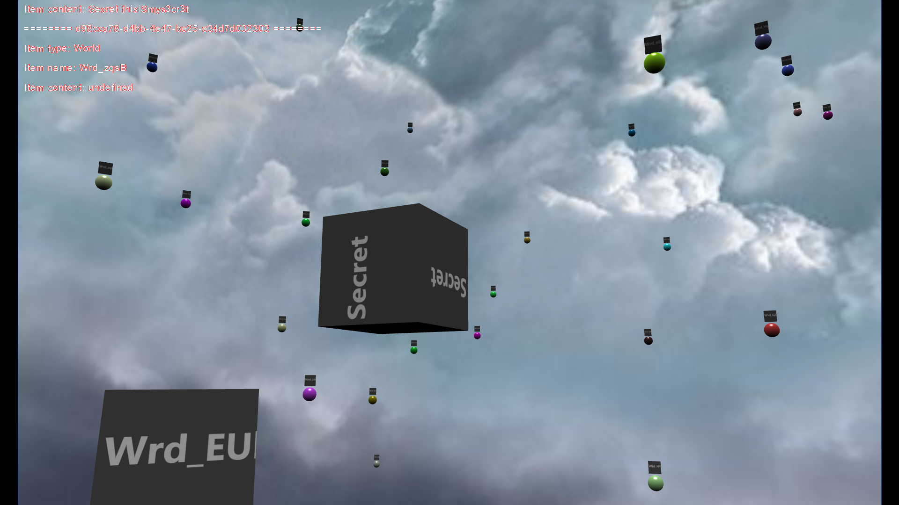

# Inception
Inception based console game

## Description
This game is some kind of experiment.
It tries to simulate inception type worlds in virtual reality.

## Why I called it 'Inception' ?
Because You can create worlds in worlds :)

## What else You can ?
* You can talk with other players in two ways
    * Send message to all players on the server - **shout**
    * Send message only to players on world You are - **tell**
* You can also leave permanent messages ( called heritage ). - **heritage**
Heritage is visible to all players on the world the heritage was created.
* It`s possible to teleport between created worlds or locations in 3D - **tp**
* You can look what items (nodes) are available for You - **look**
* Also calculation of distance in 3D space can be calculated - **distance**

## Development plans
* Posibility to generate 3D image of current world or whole universe
* Distributed worlds - a possibility to create a world with contents
stored on remote server. It`s great idea because it will be some kind of
distributed social network.
* Authorization on world scope
* Permanent database - at the moment all data is stored in memory
* Authentication
* System of story points, paid teleports

